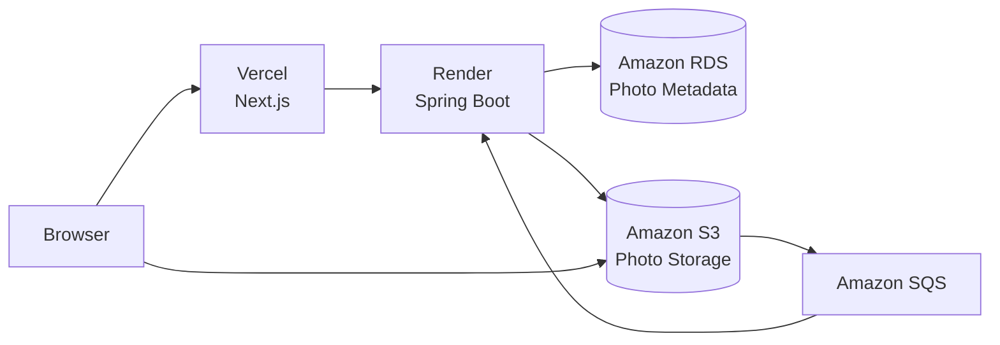
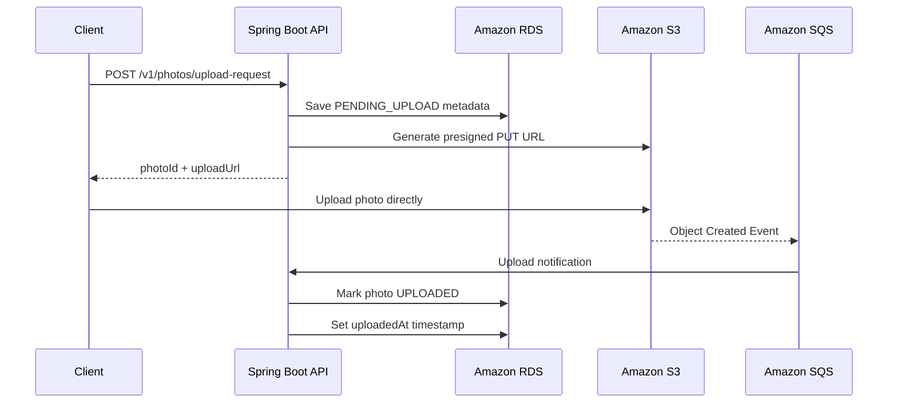
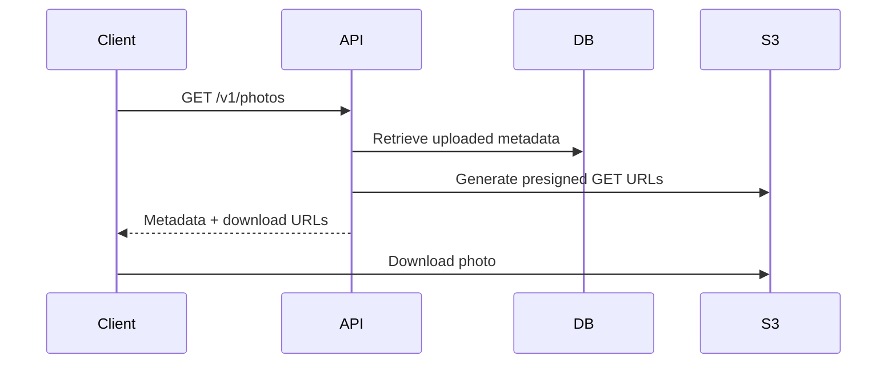
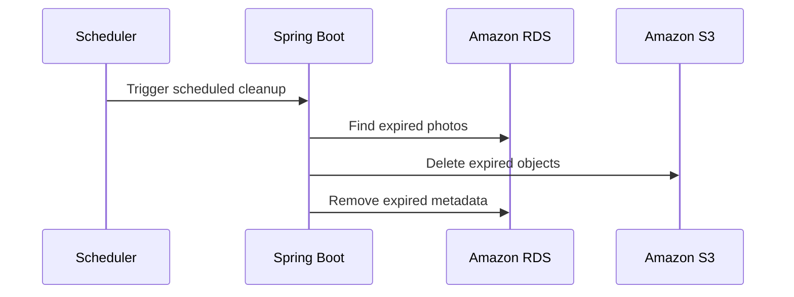

# PicLocket

PicLocket is a cloud-native photo backup application built to explore the architecture behind modern file storage systems.

During a recent interview process, I was asked to think through the design of a cloud backup service. The conversation surfaced several design decisions I wanted to understand more deeply, so instead of stopping at the interview, I decided to build the system myself.

The goal wasn't simply to upload files to Amazon S3. It was to understand how the surrounding infrastructure works together: generating presigned URLs, storing metadata separately from objects, processing uploads asynchronously, securing APIs, deploying cloud services, and designing a system that remains simple while leaving room to grow.

---

## Live Demo

Would you like to try it out?

**Frontend:** https://piclocket.vercel.app/

*The frontend communicates with a Spring Boot backend deployed on Render.*

---

## Current Status

🚀 Functional MVP

### Completed

- Direct browser uploads using Amazon S3 presigned URLs
- Metadata persistence in Amazon RDS (MySQL)
- JWT-secured backend endpoints
- Event-driven upload completion using Amazon S3 Event Notifications and Amazon SQS
- Manual photo deletion
- Automatic photo expiration
- Scheduled cleanup of expired photos
- Production deployment
  - Frontend: Vercel
  - Backend: Render
  - Database: Amazon RDS
  - Object Storage: Amazon S3

---

## Architecture



---

## Upload Flow



---

## Download Flow



---

## Cleanup Flow



---

## Technology Stack

### Backend

- Java
- Spring Boot
- Spring Security
- Spring Data JPA
- Spring Cloud AWS

### AWS

- Amazon S3
- Amazon SQS
- Amazon RDS (MySQL)
- IAM

### Deployment

- Docker
- Render

---

## Design Decisions

### Direct-to-S3 uploads

Large files never pass through the backend.

The API is responsible for authentication, authorization, metadata creation, and generating presigned URLs, while the browser uploads directly to Amazon S3.

**Benefits**

- Lower API bandwidth
- Better scalability
- Lower infrastructure costs

---

### Metadata separate from object storage

Amazon S3 stores the file.

Amazon RDS stores:

- Ownership
- Upload status
- Content type
- File size
- Timestamps

Separating metadata from object storage makes searching, filtering, and future application features much simpler.

---

### Event-driven upload completion

Rather than trusting the client to report that an upload completed, Amazon S3 publishes an Object Created event to Amazon SQS.

The backend processes the queue message and updates the upload status.

This creates a single source of truth while reducing opportunities for inconsistent state.

---

### Cost-conscious architecture

PicLocket was intentionally designed with cost in mind.

Some examples include:

- Direct browser uploads reduce backend bandwidth.
- Amazon SQS allows asynchronous processing instead of blocking API requests.
- Metadata is stored separately from large objects.
- Uploaded photos are automatically deleted after a one-hour retention period.
- A scheduled cleanup worker removes expired objects and metadata.
- Temporary download links are generated using presigned URLs instead of exposing the bucket publicly.

---

## Lessons Learned

Building PicLocket reinforced several ideas that became much clearer through implementation than through diagrams alone.

- Implementing upload state transitions made it much clearer how object storage, metadata, and asynchronous processing must stay coordinated throughout the lifecycle of a file.
- Building the end-to-end upload pipeline highlighted the importance of coordinating metadata, object storage, asynchronous processing, and deployment as a single system.
- Even a focused MVP introduced production concerns beyond application code, including cloud networking, security, environment configuration, scheduling, and cost-conscious design.

---

## Roadmap

- Monitoring and observability
- Batch uploads
- Upload deduplication

---

## Local Development

1. Configure environment variables.
2. Start MySQL (or connect to Amazon RDS).
3. Run the Spring Boot application.
4. Start the Next.js frontend.
5. Upload a photo through the web application.

---

## API Testing

A Postman collection is included for testing the backend independently of the frontend.

```text
postman/PicLocket_Final_MVP.postman_collection.json
```

The collection includes requests for:

1. Generate development JWT
2. Create upload request
3. Retrieve uploaded photos
4. Delete uploaded photo

The frontend exercises the same API endpoints used by the Postman collection.

---

## Why I Built This

One of my favorite parts of engineering is that sometimes the best way to learn a system is to build it.

PicLocket began as an interview discussion, but it became an opportunity to explore how cloud services work together to build a production-style application from the ground up.
