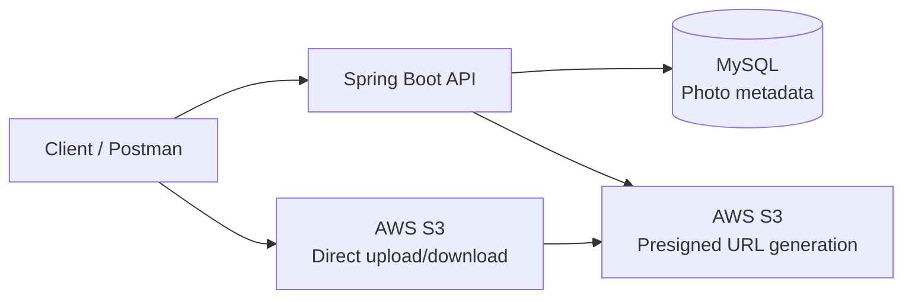
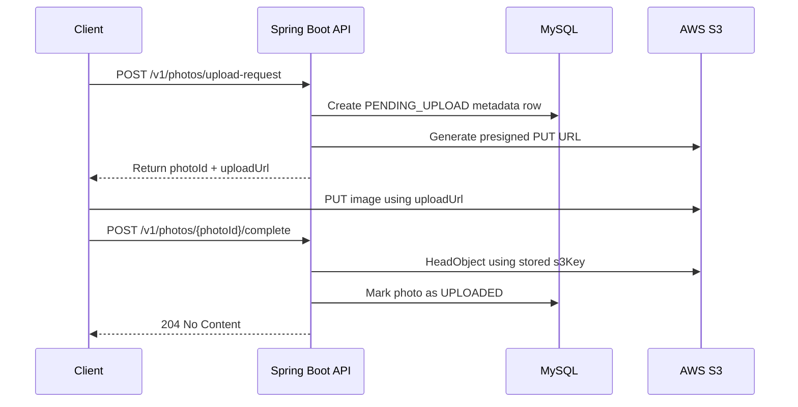
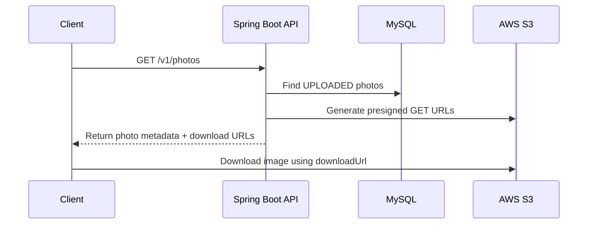

# PicLocket

PicLocket is a photo backup system built to explore:
- Direct S3 uploads using presigned URLs
- Metadata persistence
- Upload state management
- Event-driven processing with SQS

## Current Status
🚧 In Development

## Architecture


## Upload Flow



## Download Flow



## MVP Goals
- Upload photos directly to S3
- Store metadata in a relational database
- Retrieve uploaded photos
- Generate presigned download URLS

## Future Roadmap
- SQS event processing
- Background worker
- Upload quotas
- Automatic photo expiration
- Batch Uploads
- Duplicate deletion

## End-to-End Testing
A postman collection is included under

```text
postman/PicLocket.postman_collection.json
```

Workflow:

1. Create Upload Request
2. Upload File to S3
3. Complete Upload
4. Retrieve Uploaded Photos
